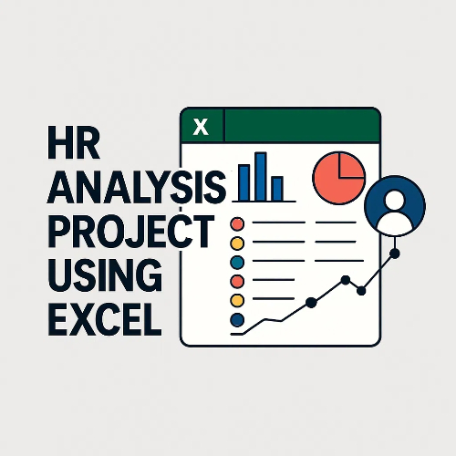

# HR Analytics Dashboard using Excel

This project is focused on analyzing HR data to uncover valuable insights related to employee performance and other key HR metrics. The goal is to support strategic HR decisions through data-driven analysis and visualization.

## 🔧 Data Cleaning

- Removed duplicated rows to ensure data integrity.
- Filled missing values to maintain consistency in analysis.

## 🔄 Data Transformation

- Appended multiple sheets into a single dataset using Power Query.
- Created calculated columns to generate deeper insights (e.g., performance delta,  Performance indicator, experience).

## 📊 Data Visualization

- Calculated and visualized key HR KPIs (e.g., performance trends, AVG salary, AVG age ).
- Explored insights through clear and interactive Excel charts to support workforce planning and performance evaluation.

## 📁 Tools Used

- Microsoft Excel
- Power Query
- Pivot Tables & Charts
